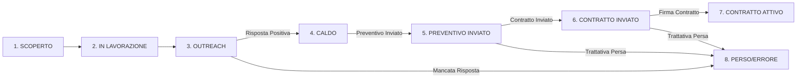

# 👹 Strategia & Architettura del "Sistema Mostro" (Radio Toscana Lead Engine)

Questo documento definisce il piano strategico e l'architettura tecnica per la costruzione del **"Sistema Mostro"**, un Lead Engine commerciale integrato e automatizzato a costo zero, progettato per automatizzare la scoperta, il tracciamento e il re-engagement dei clienti pubblicitari per Radio Toscana.

---

## 🎯 1. Filosofia Strategica: Il "Mostro" Commerciale

Il "Mostro" non è un semplice software di invio e-mail, ma un **agente commerciale autonomo** che:
1.  **Ascolta la Toscana:** Intercetta nuove opportunità leggendo le conferenze stampa in redazione, scansionando i portali di news locali e analizzando i cartelloni pubblicitari sul territorio.
2.  **Ruba ai Competitor:** Ascolta le radio concorrenti tramite lo streaming audio per identificare chi sta già investendo in pubblicità e proporre un'offerta comparativa di Radio Toscana.
3.  **Gestisce la Memoria a Lungo Termine:** Ricorda gli eventi stagionali (sagre, festival) e pianifica in automatico il contatto per l'anno successivo 3 mesi prima dell'evento.
4.  **Si auto-gestisce come HubSpot:** Traccia ogni lead all'interno di una pipeline visiva Kanban con alert automatici su Telegram se una trattativa si ferma.

---

## 🏗️ 2. Pipeline Commerciale (HubSpot Style) in NocoDB

Configureremo NocoDB (collegato a Supabase) come una dashboard commerciale visuale strutturata in fasi di ciclo di vita del lead:

### Le Fasi del CRM & Tracciamento Finanziario:
1.  **`SCOPERTO`:** Il lead è stato inserito in database (da Telegram, mail o scraping) ma non ancora lavorato.
2.  **`IN LAVORAZIONE` (Arricchito):** n8n ha scansionato il sito web con Firecrawl, trovato l'e-mail ordinaria e preparato il copy e-mail.
3.  **`OUTREACH` (Inviato Step 1/2/3):** n8n ha inviato le e-mail di cold outreach e sta attendendo la risposta.
4.  **`CALDO` (Risposto):** Il cliente ha risposto all'e-mail. Il tracciamento automatico ha bloccato i follow-up e ti ha inviato una notifica.
5.  **`PREVENTIVO INVIATO`:** Fabio ha inviato la proposta economica. Viene valorizzato il campo `valore_preventivo` e la probabilità di chiusura è impostata al **50%**.
6.  **`CONTRATTO INVIATO`:** Il contratto è stato redatto e inviato al cliente. Viene valorizzato il campo `valore_contratto` e la probabilità di chiusura sale all'**80%**.
7.  **`CONTRATTO ATTIVO` (Chiuso Vinto):** Il lead ha firmato ed è diventato cliente attivo. Il valore del contratto si trasforma in **Fatturato Reale** (100% di probabilità). Viene escluso dalle campagne di outreach.
8.  **`BLACKLIST / PERSO`:** Competitor, opt-out o trattativa non andata a buon fine.

### 📊 Campi Finanziari & Outreach Aggiunti nel Database:
*   `valore_preventivo` (Decimal): Il valore dell'offerta presentata al cliente.
*   `valore_contratto` (Decimal): Il fatturato effettivo generato dal contratto firmato.
*   `data_preventivo` (Date): Giorno di invio della proposta per calcolare i giorni di anzianità della trattativa.
*   `data_contratto` (Date): Giorno di firma del contratto per i report temporali.
*   `probabilita_chiusura` (Integer): Percentuale stimata di successo (50% per preventivi, 80% per contratti inviati).
*   `email_inviate_totali` (Integer): Conteggio di quante mail (outreach + follow-up) ha ricevuto il lead.
*   `ultimo_step_inviato` (Integer): Step della sequenza raggiunto (1, 2 o 3).
*   `data_ultimo_invio` (Timestamp): Data e ora dell'ultimo messaggio inviato, fondamentale per calcolare il tempo di silenzio del lead.

---

## 📡 3. Moduli di Ingestion Intelligenti (Gli Input)

### A. Telegram Bot OOH Scouter (Vision AI) — *[GIRANTE SU FIRECRRAWL/GROQ]*
*   **Azione:** Fabio fotografa un cartellone stradale, un volantino o una sagra.
*   **Automazione:** Llama 3.2 Vision estrae il brand e il comune ➔ Tavily trova il sito ➔ Firecrawl lo legge ➔ Llama 3.3 scrive la mail e trova i contatti ➔ Inserimento in Supabase in stato `SCOPERTO`.

### B. Competitor Audio Stream Scraper (Intercettazione)
*   **Azione:** Script Python su OCI scarica a intervalli regolari lo streaming audio di Radio Bruno o altre radio locali.
*   **Automazione:**
    1.  Esegue lo Speech-to-Text tramite **Whisper API su Groq** (gratuito) per convertire la pubblicità in testo.
    2.  Usa **Llama 3.3** per identificare i brand che hanno trasmesso spot (es. *"Auto P ha trasmesso uno spot per la nuova Peugeot"*).
    3.  Cerca su Tavily/Firecrawl i loro contatti e li inserisce in Supabase sotto la campagna `COMPETITOR_STEAL` notificando Fabio.

### C. Press Box Scanner (Redazione)
*   **Azione:** n8n si collega via IMAP alla casella e-mail di redazione dove arrivano le conferenze stampa.
*   **Automazione:** L'AI analizza gli allegati e il testo alla ricerca di eventi sponsorizzati, festival o inaugurazioni. Estrae l'organizzatore, calcola la data dell'evento e inserisce il lead nel CRM pre-impostato per la data corretta.

### D. Web Portal Crawler (GoNews & Testate Toscane)
*   **Azione:** n8n scansiona periodicamente le home page dei portali locali toscani (GoNews, PisaToday, ecc.).
*   **Automazione:** Rileva la presenza di banner pubblicitari attivi, ne estrae il link di destinazione del banner (il sito del cliente) e inserisce il cliente nel database. Se spende sui banner locali, ha budget per la radio!

---

## 🗂️ 4. Il Sistema di Memory Lock per Sagre e Ricorrenze

Per i clienti stagionali (Pro Loco, sagre, festival estivi):
*   Se un lead è contrassegnato come **`Ricorrente`** (es. *Sagra del Tordello*), n8n salva la data dell'evento (es. *15 Luglio*).
*   Quando la campagna finisce (in stato Perso o Chiuso), n8n calcola la data dell'evento dell'anno successivo (es. *15 Luglio 2027*) e inserisce un trigger temporale.
*   **3 mesi prima** (es. *15 Aprile 2027*), n8n riporta in automatico lo stato del lead su `SCOPERTO` riavviando la campagna di re-engagement prima che gli organizzatori acquistino la cartellonistica cartacea o investano altrove.

---

## 📊 5. Dashboard di Controllo (Google Looker Studio)

Creeremo un pannello di controllo grafico collegato direttamente a Supabase per darti visibilità a costo zero su:

1.  **Funnel delle Trattative:** Numero di leads in ogni fase (Nuovi ➔ Outreach ➔ Interessati ➔ In Preventivo ➔ Chiusi).
2.  **Monitor Competitor:** Elenco in tempo reale dei brand estratti dallo streaming dei concorrenti, con pulsante rapido per attivare la campagna di conquista.
3.  **Tasso di Risposta:** Quali sono i settori (automotive, sagre, retail) che rispondono di più.
4.  **Coda dei Follow-up:** Alert visivi sulle trattative ferme da più di 7 giorni che richiedono un tuo sollecito.

---

## 🛠️ 6. Piano di Implementazione & Fasi

### Fase 1: Migrazione a Costo Zero (n8n + Firecrawl + Groq)
*   Aggiornamento dei workflow n8n sul Desktop per usare le API free di Firecrawl, Groq (Llama 3.3) e Tavily.
*   *Verifica:* Test di invio ed estrazione completato con successo.

### Fase 2: Strutturazione CRM & Pipeline Kanban in NocoDB
*   Creazione dei campi aggiuntivi su Supabase (fase_commerciale, data_evento, flag_ricorrente).
*   Configurazione della vista Kanban "HubSpot Style" su NocoDB.

### Fase 3: Il Blocco Competitor (Audio Streaming Scraper)
*   Scrittura dello script Python su OCI per registrare e trascrivere con Whisper/Groq lo streaming audio delle radio concorrenti.
*   Integrazione dei brand rilevati nel CRM.

### Fase 4: Integrazione Redazione & Portali News
*   Collegamento alla mail di redazione e attivazione del parser delle conferenze stampa.
*   Crawler dei banner di GoNews.

### Fase 5: Dashboard Looker Studio
*   Configurazione del report grafico su Google Looker Studio collegato a Supabase.
